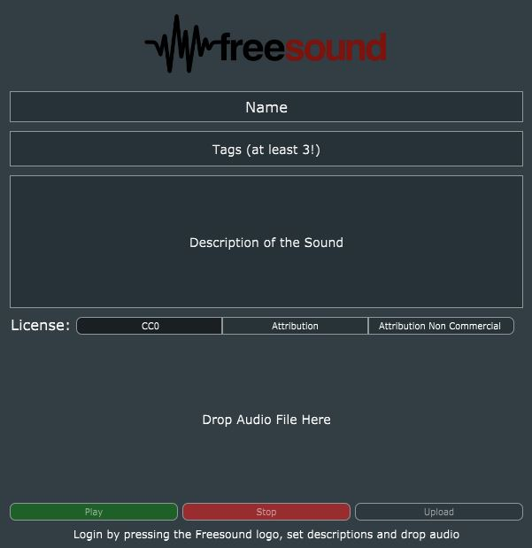

# Freesound Uploader
A JUCE based plugin and audio application for uploading sounds to Freesound.org without opening a web browser, which can be ran as a plugin in a Digital Audio Workstation.

Usage
-------

To use this application, the user should execute it either as a standalone application or as a plugin in a Digital Audio Workstation. Then, the following steps should be performed:

* Login by pressing the Freesound Logo, enter Freesound username and password and authorize the application.
* Add a name to the sound.
* Add tags to the sound. Tags can be separated with spaces and multi-words can be joined with dashes (e.g. “tag1 tag2 tag3 cool-tag4”).
* Add a textual description to the sound.
* Select the license desired for the sound.
* Drag and drop a supported audio file from the filesystem or from a DAW.
* Press the upload button and confirm in the status textbox if the upload was successfull.

The user interface of this application is shown below for easy referencing.

More information on the supported files and how to fill the name, tags and descritption of sounds can be 
accessed here: https://freesound.org/help/faq/

Installation
-------

In order to install Freesound Uploader, the JUCE framework should be downloaded, installed and setup. A tutorial on how to do this is available in https://docs.juce.com/master/tutorial_new_projucer_project.html
Firstly, the "Getting Started" section should be performed. Then, the FreesoundUploader.juce file should be opened with the projucer.
Before building it you should edit the file `FreesoundUploader/Source/FreesoundKeys.h`, request a Freesound API key and add it to that file.
The final step is setting up the desired plugin export formats in the Projucer project settings and, finally you should open this project on the desired Juce exporter and build the solution.
In case a VST2 build of the plugin is desired, a VST2 SDK should be provided and linked in the Projucer global paths.

In order to use this application, a Freesound.org account is needed. One can be created in https://freesound.org/home/register/

Authors
-------
António Ramires
aframires@gmail.com
